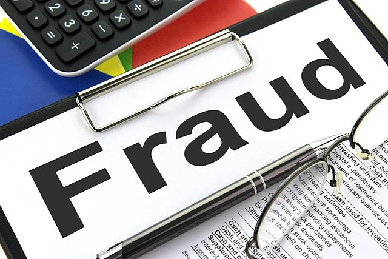

# Found-in-a-random-forest: Detecting Credit Card Fraud with Machine Learning

According to the Federal Trade Commission (FTC), in 2021 more than $5.8 billion was lost due to reported fraud [(Mayfield, 2022)](https://www.ftc.gov/news-events/news/press-releases/2022/02/new-data-shows-ftc-received-28-million-fraud-reports-consumers-2021-0). To help in the fight against fraudsters, I constructed a decision tree and random forest model using [(Kaggle's)](https://www.kaggle.com/datasets/mlg-ulb/creditcardfraud?datasetId=310&sortBy=voteCount) Credit Card Fraud Detection dataset. After pruning the random forest model and reducing its complexity, it had an F1-Score of ~72 and an Area Under the Curve of 0.92. 

