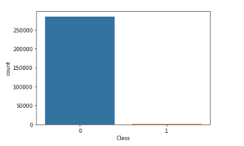
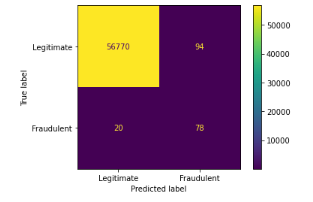
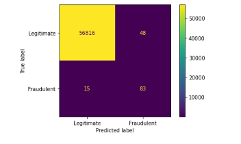

# Found in a Random Forest: Detecting Credit Card Fraud with Machine Learning

According to the Federal Trade Commission (FTC), in 2021 more than $5.8 billion was lost due to reported fraud [(Mayfield, 2022)](https://www.ftc.gov/news-events/news/press-releases/2022/02/new-data-shows-ftc-received-28-million-fraud-reports-consumers-2021-0). To help in the fight against fraudsters, I constructed a decision tree and random forest model using [Kaggle's Credit Card Fraud Detection data set](https://www.kaggle.com/datasets/mlg-ulb/creditcardfraud?datasetId=310&sortBy=voteCount). After pruning the random forest model and reducing its complexity, it had an F1 Score of ~72 and an Area Under the Curve (AUC) of 0.92. 

# Business Understanding and Data Understanding
All organizations, governments, and private citizens are at risk of becoming victims to fraud. In 2021, there was over 995,000 reports of imposter scams, over 390,000 reports of government documents and/or benefts fraud, and almost 390,000 reports of credit card fraud [(FTC Consumer Sentinel Network, 2022)](https://public.tableau.com/app/profile/federal.trade.commission/viz/TheBigViewAllSentinelReports/TrendsOverTime).

The supervised machine learning models below can be leveraged to help detect and prevent financial fraud; specifically, credit card fraud. By detecting and preventing financial fraud, organizations, individuals, and even governments can protect their assets from bad actors.

The dataset used contains transactions made by credit cards in September 2013 by European cardholders. The dataset presents 284,807 transactions, of which 492 were fraudulent. As this dataset contains real-world credit card transactions, it is highly suitable for tackling the problem of financial fraud.

The dataset will require minimal preprocessing as it only contains numerical input variables. 28 of 30 features have already undergone a PCA transformation. Of note, due to confidentiality reasons, the only labeled features are 'Time' and 'Amount', which are the two that have not undergone PCA. The rest are labeled as V1 - V28. Feature 'Class' is the response variable as it indicates if the transaction was deemed fraudulent with 1 being fraudulent and 0 being legitimate. The data is imbalanced and Synthetic Minority Oversampling Technique (SMOTE) was used to handle this problem.

**Class Imbalance Visualization**

# Modeling and Evaluation
I used a decision tree and a random forest model to solve the classification problem. The pruned random forest model performed adequately compared to the other models and was less complex; therefore, it was the best model. With less features, the model ran faster and was easier to evaluate. The model had F1 Score is ~72 and an AUC of 0.92. The baseline decision tree model had an F1 Score of ~58 and an AUC of 0.89, and was most likely overfitting.

**Decision Tree Confusion Matrix**

**Pruned Random Forest Matrix** 

# Conclusion
The pruned random forest model had an average F1 score and when wrong, the model leaned toward false positive over false negative, which in the case of fraud is the more desirable outcome. When fraud occurs, it requires significant resources to recover the losses; therefore, it is better to cry wolf than miss the wolf entirely. It is recommended that the model be used in a cursory fashion to quickly flag transactions actions for further review. The role of the model is not to serve as the jury, judge, and executioner, but rather, serve as a tool for investigators to more efficiently review transactions and be the first line of defense against fraud.

# Repository Navigation
In the GitHub repository, you will be able to find the [Jupyter Notebook](notebook.ipynb) and the [Presentation](Capstone_Presentation.pptx) on the main page. The data set is over 100mb and will need to be downloaded from [Kaggle](https://www.kaggle.com/datasets/mlg-ulb/creditcardfraud?datasetId=310&sortBy=voteCount). The proposal folder contains the proposal for this project as well as some collateral images.

To reproduce the findings:
1. Utilize a transactional data set classified between fraudulent and legitimate.
2. Import the following packages: numpy, pandas, matplot, seaborn, sklearn, and imblearn.
3. Conduct EDA as neccessary. This could include scaling, handling null values, and/or handling imbalances in the data.
4. Split the data along the target variable between training and testing data utilizing an 80/20 ratio.
5. Build a decision tree and random forest model by utilizing sklearn's library.
6. Evaluate the models and conduct feature importance.
7. Prune the models as necessary and evaluate.